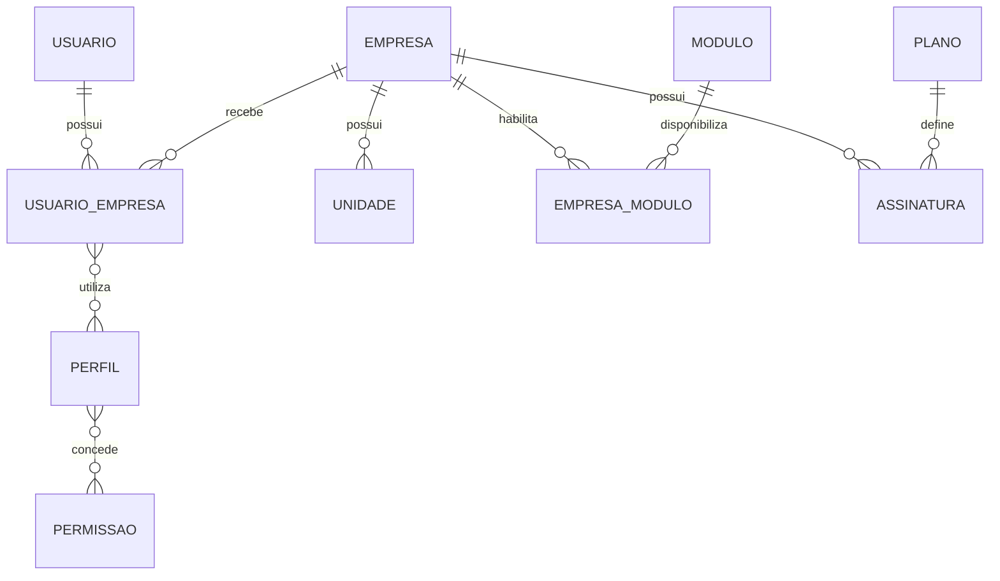

# Modelo Multiempresa — Criati

## Objetivo

Este documento define como a Criati atenderá várias empresas dentro da mesma plataforma, mantendo dados, usuários, unidades, permissões e módulos corretamente isolados.

## Conceitos principais

### Plataforma Criati

Representa a administração central do SaaS.

A equipe da Criati poderá:

- cadastrar empresas;
- administrar planos;
- controlar assinaturas;
- ativar módulos;
- acompanhar implantações;
- consultar auditorias administrativas;
- prestar suporte temporário e auditado futuramente.

### Empresa

Representa um cliente da Criati.

Cada empresa terá:

- dados cadastrais;
- configurações;
- fuso horário;
- unidades;
- usuários vinculados;
- perfis e permissões;
- módulos contratados;
- plano e assinatura;
- dados operacionais isolados.

### Unidade

Representa uma matriz, filial, loja, departamento ou local de operação.

- Toda empresa terá uma Unidade Principal.
- Unidades adicionais serão opcionais.
- Um usuário poderá acessar todas ou apenas algumas unidades.
- Os módulos serão contratados pela empresa.
- Os dados operacionais poderão ser vinculados a uma unidade.

### Usuário

O usuário será global na plataforma e identificado principalmente pelo e-mail.

O mesmo usuário poderá participar de várias empresas utilizando o mesmo login.

Exemplo:

```text
Usuário: maria@email.com
├── Empresa A → Administradora
├── Empresa B → Gestora
└── Empresa C → Usuária
```

O usuário não terá permissões empresariais diretamente. Elas serão determinadas pelo vínculo com cada empresa.

## Relacionamentos principais



## Vínculo entre usuário e empresa

A entidade `usuario_empresa` representará a participação do usuário em uma empresa.

Campos conceituais:

```text
id
usuario_id
empresa_id
status
data_entrada
data_saida
criado_em
criado_por
atualizado_em
atualizado_por
```

Possíveis estados:

```text
CONVIDADO
ATIVO
BLOQUEADO
INATIVO
```

Regras:

- o mesmo usuário não poderá ter dois vínculos ativos duplicados com a mesma empresa;
- o vínculo deverá estar ativo para permitir acesso;
- desativar o vínculo não apagará o usuário;
- o histórico será preservado;
- perfis e unidades autorizadas serão associados ao vínculo.

Implementação atual (fase de fundação): `usuario_empresa` usa apenas `ATIVO`/`INATIVO` (`StatusCadastro`); não existe estado `CONVIDADO` no vínculo. O convite é uma entidade própria (`Convite`, tabela `convite`), separada de `usuario_empresa` — o vínculo só passa a existir depois que o convite é aceito. `BLOQUEADO` permanece fora do escopo. Ver `docs/DECISOES.md`, seção "Convites".

## Acesso às unidades

O vínculo poderá possuir acesso:

- a todas as unidades da empresa; ou
- somente a unidades selecionadas.

Estrutura conceitual:

```text
usuario_empresa_unidade
- id
- usuario_empresa_id
- unidade_id
```

O backend deverá verificar o acesso à unidade antes de consultar ou alterar dados relacionados a ela.

## Perfis e permissões

A Criati oferecerá perfis padrão:

```text
Administrador da empresa
Gestor
Usuário
```

Cada empresa também poderá criar perfis personalizados.

Exemplos:

```text
Financeiro
Estoquista
Atendente
Supervisor
Consultor
```

Permissões poderão representar ações como:

```text
TAREFA_VISUALIZAR
TAREFA_CRIAR
TAREFA_EDITAR
TAREFA_EXCLUIR
TAREFA_APROVAR
USUARIO_VISUALIZAR
USUARIO_CONVIDAR
USUARIO_EDITAR
PERFIL_ADMINISTRAR
RELATORIO_EXPORTAR
```

Uma permissão deverá identificar claramente:

```text
módulo
recurso
ação
```

## Módulos por empresa

A Criati manterá um catálogo global de módulos.

Exemplos:

```text
Núcleo
Tarefas e Processos
Financeiro
Estoque
Clientes
Relatórios
Inteligência Artificial
```

A entidade `empresa_modulo` controlará quais módulos estão disponíveis para cada empresa.

Campos conceituais:

```text
id
empresa_id
modulo_id
status
ativado_em
desativado_em
configuracoes
```

Regras:

- somente a administração da Criati poderá ativar um módulo contratado;
- o administrador da empresa poderá distribuir o acesso ao módulo;
- possuir uma permissão não libera um módulo não contratado;
- um módulo desativado não deverá aparecer no menu;
- desativar um módulo não apagará seus dados.

## Planos e assinaturas

O plano definirá os limites comerciais da empresa.

Exemplos de limites:

```text
quantidade de usuários
quantidade de unidades
armazenamento
recursos de IA
módulos incluídos
```

A assinatura ligará uma empresa a um plano.

Estados da assinatura:

```text
TESTE
ATIVA
ATRASADA
SUSPENSA
CANCELADA
```

No MVP, o controle da assinatura será manual.

## Seleção da empresa

Após a autenticação:

1. o sistema buscará os vínculos ativos do usuário;
2. se houver apenas uma empresa, poderá selecioná-la automaticamente;
3. se houver várias, mostrará a tela de seleção;
4. o usuário escolherá a empresa;
5. o backend validará o vínculo;
6. o contexto da empresa será criado;
7. módulos, unidades e permissões serão carregados.

Implementação atual (fase de fundação):

- `GET /api/contexto/empresas` lista os vínculos ATIVOS do usuário autenticado;
- `POST /api/contexto/empresa-ativa` seleciona a empresa ativa, validando vínculo ATIVO e empresa ATIVA (nega com 403 genérico caso contrário);
- `GET /api/contexto/empresa-ativa` consulta o contexto atual, revalidando vínculo e empresa a cada chamada;
- `DELETE /api/contexto/empresa-ativa` limpa o contexto sem encerrar a autenticação;
- seleção automática quando há apenas uma empresa, unidades e módulos ainda não foram implementados nesta fase.

## Troca de empresa

Um usuário vinculado a várias empresas poderá trocar o contexto sem realizar um novo login.

A troca deverá:

- validar novamente o vínculo;
- limpar o contexto anterior;
- carregar permissões da nova empresa;
- carregar unidades autorizadas;
- carregar módulos ativos;
- registrar a troca para auditoria quando necessário.

## Contexto atual

O contexto da requisição deverá conter, no mínimo:

```text
usuario_id
empresa_id
usuario_empresa_id
unidades_autorizadas
perfis
permissoes
modulos_ativos
```

Esse contexto será criado pelo backend após validação.

Implementação atual: o contexto vive na sessão HTTP (`CONTEXTO_EMPRESA_ID`, `CONTEXTO_USUARIO_EMPRESA_ID`, nenhuma entidade JPA armazenada) e é revalidado no banco a cada uso via `ContextoEmpresaService`; contém `usuario_id`, `empresa_id`, `usuario_empresa_id` e `perfil`. Unidades autorizadas, permissões granulares e módulos ativos ainda não existem e ficam para fases futuras.

## Isolamento dos dados

Tabelas empresariais deverão possuir obrigatoriamente:

```text
empresa_id
```

Quando o registro pertencer a uma unidade:

```text
unidade_id
```

Exemplo:

```text
tarefa
- id
- empresa_id
- unidade_id
- titulo
- responsavel_id
- status_id
```

Toda consulta empresarial deverá filtrar pelo contexto atual.

Exemplo conceitual correto:

```sql
SELECT *
FROM tarefa
WHERE empresa_id = :empresaAtual;
```

Exemplo proibido:

```sql
SELECT *
FROM tarefa;
```

## Regras obrigatórias de segurança

- Nunca confiar no `empresa_id` enviado pelo navegador.
- Nunca aplicar o isolamento somente na interface.
- Nunca buscar um registro empresarial apenas pelo seu UUID.
- Sempre combinar o identificador do registro com a empresa atual.
- Sempre validar o vínculo do usuário.
- Sempre validar unidades autorizadas quando aplicável.
- Sempre verificar módulo ativo e permissão.
- Nunca permitir troca de empresa apenas alterando uma URL.
- Nunca registrar dados sensíveis desnecessariamente nos logs.

Consulta conceitual segura:

```text
buscar tarefa por:
- tarefa_id;
- empresa_id do contexto atual.
```

## Tabelas globais e empresariais

### Tabelas globais

Não pertencem diretamente a uma empresa:

```text
usuario
modulo
permissao
plano
```

### Tabelas empresariais

Devem possuir `empresa_id`:

```text
unidade
usuario_empresa
perfil
empresa_modulo
assinatura
tarefa
status_tarefa
categoria_tarefa
arquivo
notificacao empresarial
auditoria empresarial
```

## Superadministrador da Criati

O Superadministrador será um papel da plataforma, não um perfil comum de empresa.

Ele poderá administrar o SaaS, mas não deverá acessar silenciosamente os dados operacionais dos clientes.

O acesso operacional futuro será feito pelo modo de suporte:

- temporário;
- motivado;
- visível;
- auditado;
- encerrado automaticamente;
- sem utilizar a senha do cliente.

Implementação atual (fase de fundação): o papel é representado por `Usuario.superAdministrador` (booleano na tabela `usuario`, tabela global) — **não** é uma linha em `usuario_empresa` e não está vinculado a nenhuma empresa. Um Superadministrador não aparece em nenhuma consulta de vínculo multiempresa (`ContextoEmpresaService`, seleção de empresa, etc.); ele acessa exclusivamente rotas globais (`/api/admin/**`, `POST /api/empresas`, `POST /api/usuarios`), nunca o contexto de empresa ativa. O modo de suporte (acesso operacional aos dados de um cliente) permanece não implementado, conforme o restante desta seção.

## Desativação

Registros empresariais importantes não serão excluídos pelas operações comuns.

Serão utilizados:

```text
ATIVO
INATIVO
SUSPENSO
CANCELADO
ARQUIVADO
```

O estado adequado dependerá do tipo de registro.

## Testes obrigatórios

Deverão existir testes que comprovem:

1. usuário da Empresa A não acessa dados da Empresa B;
2. UUID válido de outro cliente não concede acesso;
3. usuário sem vínculo ativo não entra na empresa;
4. usuário não acessa unidade não autorizada;
5. módulo desativado não pode ser utilizado;
6. permissão de uma empresa não vale para outra;
7. troca de empresa substitui corretamente o contexto;
8. empresa suspensa respeita as regras definidas;
9. consultas não retornam registros de outros clientes.

## Princípio principal

Nenhum dado empresarial poderá ser consultado, alterado, exportado ou excluído sem que o backend conheça e valide a empresa atual.