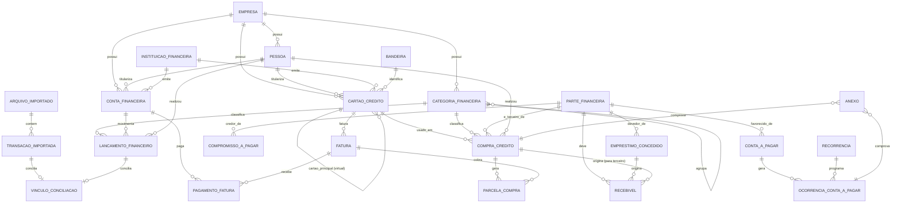

# Modelo de Dados — Financeiro LeS

Modelo conceitual e lógico do Financeiro LeS: entidades, responsabilidades, relacionamentos,
cardinalidades e agregados. Nenhuma entidade Java, migration, repository ou tabela real foi
criada nesta tarefa — este documento descreve o modelo em nível conceitual, para orientar a
modelagem técnica de uma etapa futura. Convenções de nomenclatura, tipos de coluna, auditoria
padrão e exclusão lógica seguem `docs/BANCO_DE_DADOS.md`; a estratégia multiempresa segue
`docs/MODELO_MULTIEMPRESA.md` — ambas reaproveitadas aqui, não redefinidas.

A decisão arquitetural (núcleo compartilhado + extensões específicas) e a justificativa completa
estão em `ARQUITETURA-FUNCIONAL.md`. Este documento assume essa decisão e detalha as entidades
que decorrem dela.

## 1. Núcleo financeiro compartilhado

Entidades que já existem (parcialmente) no módulo `FINANCEIRO` genérico (`docs/FINANCEIRO.md`) ou
que são genuinamente reutilizáveis por qualquer empresa da plataforma, não específicas do uso
residencial.

### ContaFinanceira (já existe — reaproveitada sem alteração de contrato)

Campos conceituais (os já existentes em `docs/FINANCEIRO.md`, mais os que esta tarefa acrescenta
conceitualmente para o uso residencial):

```text
id, empresa_id, pessoa_titular_id (novo), instituicao_id (novo), nome, tipo, moeda (novo, padrão BRL),
saldo_inicial, data_saldo_inicial (novo), status, permite_conciliacao (novo),
criado_em, criado_por, atualizado_em, atualizado_por, excluida_em, excluida_por
```

Tipos: `CONTA_CORRENTE`, `CONTA_PAGAMENTO`, `POUPANCA`, `DINHEIRO`, `CARTEIRA`, `OUTRA` — superset
do `TipoContaFinanceira` já existente (`CAIXA`, `CONTA_CORRENTE`, `POUPANCA`, `INVESTIMENTO`,
`OUTRA`); a conciliação entre os dois enums é uma decisão de modelagem técnica futura, não desta
tarefa.

**Recomendação confirmada**: cartão de crédito **não** é uma conta financeira — ele tem limite,
fatura, fechamento e comportamento próprios, incompatíveis com o conceito de saldo de uma conta
(seção 3 abaixo).

### Instituição financeira

```text
id, empresa_id (nulo = catálogo global da plataforma), nome, codigo_banco (opcional), ativa
```

**Decisão**: tabela cadastrável, não enumeração fechada. Instituições financeiras (Banco do
Brasil, Banco Inter, outras) são um conceito universal da plataforma, não específico de uma
empresa — o catálogo é **global** (mesmo padrão já usado por `Aplicacao`, catálogo global da
plataforma, ver `docs/MODELO_MULTIEMPRESA.md`), mas cada empresa pode cadastrar uma instituição
adicional que não esteja no catálogo global, sem exigir aprovação de terceiros. Isso evita tanto
uma enumeração rígida (que impediria novos bancos) quanto duplicar o mesmo banco por empresa.

### Bandeira

```text
id, empresa_id (nulo = catálogo global), nome, ativa
```

Mesma decisão da instituição financeira: catálogo global cadastrável (Elo, Mastercard, Visa,
outras), com possibilidade de a empresa adicionar uma bandeira não listada.

### CategoriaFinanceira (já existe — reaproveitada, com um campo conceitual novo)

Campos já existentes em `docs/FINANCEIRO.md`, mais:

```text
categoria_pai_id (novo, opcional, para agrupamento)
usar_em_orcamento (novo, booleano)
```

Regras (herdadas de `docs/FINANCEIRO.md`, reafirmadas para o uso residencial):

- uma categoria desativada **nunca desaparece** dos lançamentos, compras ou parcelas históricas —
  a desativação apenas impede novo uso, nunca oculta o passado (mesmo princípio de `status` já
  usado para conta e categoria no módulo genérico);
- a categoria de uma compra parcelada pertence à compra, nunca à parcela individualmente — a
  parcela sempre herda a categoria vigente na compra no momento de sua criação; uma mudança
  retroativa de categoria na compra original recalcula as parcelas ainda não pagas (ver
  `INVARIANTES.md`);
- o agrupamento por `categoria_pai_id` é usado apenas para apresentação/relatório e limites de
  orçamento por grupo — não altera a categorização individual de um lançamento.

### LancamentoFinanceiro (já existe — mantido para receita, despesa no débito e transferência)

Mantido como está descrito em `docs/FINANCEIRO.md`, com um campo conceitual adicional:

```text
natureza (novo): RECEITA | DESPESA | TRANSFERENCIA_SAIDA | TRANSFERENCIA_ENTRADA | PAGAMENTO_FATURA
origem (novo): MANUAL | IMPORTADO | GERADO_PELA_FATURA
pessoa_id (novo, opcional): quem realizou a receita/despesa, para o filtro por pessoa (`VISAO-FUNCIONAL.md`)
transferencia_vinculo_id (novo, opcional): aponta para a outra ponta de uma transferência entre contas próprias
```

**Decisão sobre entidade única × entidades especializadas**: `LancamentoFinanceiro` permanece uma
entidade única e simples, usada apenas para o que é genuinamente simples (receita, despesa no
débito, transferência entre contas próprias, e o registro de saída de caixa gerado por um
pagamento de fatura). Compra no crédito **não** é modelada como um `LancamentoFinanceiro` — ela
tem atributos estruturalmente diferentes (cartão, parcelas, estabelecimento, fatura) e vira uma
entidade própria (`CompraCredito`, seção 4) na extensão. Isso evita tanto duplicar toda a
complexidade de crédito dentro do núcleo genérico quanto perder a simplicidade do lançamento
básico, que outras empresas usando só o `FINANCEIRO` genérico continuam usando sem nenhuma dessas
extensões.

O campo `natureza=TRANSFERENCIA_SAIDA/ENTRADA` com `transferencia_vinculo_id` implementa a regra
de que uma transferência entre contas próprias nunca é somada como receita nem despesa
consolidada (`REGRAS-DE-NEGOCIO.md`) — o cálculo de gasto real e de renda deve explicitamente
excluir essas duas naturezas.

O campo `natureza=PAGAMENTO_FATURA` implementa a regra de que o pagamento da fatura é saída de
caixa, mas nunca um novo consumo (`REGRAS-DE-NEGOCIO.md`) — esse lançamento nunca soma no cálculo
de gasto real, apenas no cálculo de saída efetiva.

## 2. Matriz operação × visão

Como cada operação afeta as três visões definidas em `PROCESSOS.md`/`GLOSSARIO.md` (consumo,
fluxo de caixa, comprometimento futuro) e o patrimônio (saldo consolidado + valores a
receber − valores a pagar):

| Operação | Afeta consumo? | Afeta caixa? | Afeta comprometimento? | Afeta patrimônio? |
| --- | --- | --- | --- | --- |
| Compra no débito | Sim, no momento da compra | Sim, imediatamente (mesma operação) | Não (já liquidada) | Sim (reduz saldo) |
| Compra no crédito (valor total) | Sim, no momento da compra | Não (só quando a fatura for paga) | Sim, até a fatura ser paga | Sim (aumenta obrigação futura) |
| Parcela (visão mensal) | Não (já contada na compra) | Não (só quando a fatura correspondente for paga) | Sim, no mês em que é cobrada | Não (é só uma fração de algo já reconhecido) |
| Pagamento de fatura | Não (consumo já reconhecido nas compras) | Sim | Reduz o comprometimento pago | Sim (reduz saldo, reduz obrigação) |
| Transferência entre contas próprias | Não | Não, no consolidado (move entre contas) | Não | Não |
| Empréstimo concedido | Não | Sim (sai da conta) | Não é uma obrigação da família | Não muda o total (saldo vira valor a receber) |
| Empréstimo recebido (compromisso) | Não | Sim (entra na conta) | Sim (obrigação futura) | Não muda o total (caixa aumenta, obrigação aumenta) |
| Compra para terceiro | Não (excluída do consumo residencial) | Não (só quando a fatura for paga) | Sim, para a família, até ser reembolsada | Sim (gera valor a receber) |
| Recebimento de terceiro | Não | Sim (entra na conta) | Reduz o valor a receber | Não muda o total (caixa aumenta, recebível diminui) |
| Estorno (integral ou parcial) | Reduz o consumo já reconhecido | Depende (pode gerar crédito em fatura futura) | Reduz o comprometimento futuro correspondente | Sim (reduz a obrigação) |

Esta matriz é a referência normativa para qualquer cálculo em `CALCULOS-E-INDICADORES.md` que
precise decidir se uma operação entra ou não em uma soma.

## 3. Extensões do Financeiro LeS

Entidades específicas do uso residencial, que **não** fazem parte do módulo `FINANCEIRO` genérico
e não devem ser expostas a empresas que não contratarem essa extensão (ver
`ARQUITETURA-FUNCIONAL.md` para a estratégia de habilitação por empresa).

### Pessoa

```text
id, empresa_id, nome, usuario_id (opcional), ativa
```

Representa quem realizou, recebeu ou é titular de uma operação financeira — **não** duplica
dados de autenticação. `usuario_id` é **opcional**: uma pessoa pode existir sem estar vinculada a
um usuário com login (ex.: um dependente sem conta própria), mas os dois usuários operacionais do
Financeiro LeS devem cada um ter uma `Pessoa` correspondente para que os filtros "quem realizou"
funcionem para ambos. `ContaFinanceira.pessoa_titular_id` e `CartaoCredito.pessoa_titular_id`
referenciam `Pessoa`, nunca `usuario_id` diretamente.

### Favorecido (`ParteFinanceira`)

```text
id, empresa_id, nome, tipo, documento (opcional), ativo
```

Tipo: `ESTABELECIMENTO`, `CREDOR`, `DEVEDOR`, `DESTINATARIO_PIX`, `PESSOA_BENEFICIADA`, `OUTRO`.

**Decisão**: uma única entidade `ParteFinanceira`, não entidades separadas por papel. O mesmo
favorecido pode ocupar papéis diferentes ao longo do tempo (ex.: uma pessoa que hoje é
"destinatário PIX" do pagamento do apartamento poderia, em outra operação, ser um "credor" de um
empréstimo informal) — o papel é uma propriedade da operação (compromisso, empréstimo, compra),
não do cadastro do favorecido em si. `documento` é opcional para suportar pessoa física ou
organização sem exigir dados fiscais completos no MVP.

### Anexo

```text
id, empresa_id, entidade_relacionada, entidade_id, tipo, nome_original, tipo_mime, tamanho,
localizacao, hash, usuario_id, criado_em, excluido_em, excluido_por
```

Metadados apenas — o conteúdo binário não é definido nesta tarefa (estratégia de armazenamento
de arquivo é uma decisão técnica futura, fora do escopo de modelo de dados conceitual). Privado
ao tenant (`empresa_id` obrigatório), nunca publicamente acessível; segue o mesmo ciclo de lixeira
do registro ao qual está vinculado (`entidade_relacionada` + `entidade_id`).

### Recorrência (modelo reutilizável)

```text
id, empresa_id, frequencia, intervalo, dia_referencia, data_inicial, data_final (opcional),
proxima_geracao, ativa, regra_valor, valor_estimado
```

Frequência: `SEMANAL`, `QUINZENAL`, `MENSAL`, `TRIMESTRAL`, `SEMESTRAL`, `ANUAL`,
`PERSONALIZADA`. `regra_valor`: `FIXO` ou `VARIAVEL` (ver `PROCESSOS.md`, seção 7).

Reutilizada por: salário recorrente (receita), conta a pagar recorrente, assinatura, empréstimo/
compromisso com parcelamento regular. Cada ocorrência gerada é um registro próprio da entidade que
a usa (ex.: uma `OcorrenciaContaAPagar`), sempre vinculado à `Recorrencia` que a gerou — a
`Recorrencia` em si nunca é o lançamento, apenas a regra de geração.

Estratégia para os casos citados na tarefa:

- **Editar somente uma ocorrência**: altera apenas o registro da ocorrência gerada, sem tocar na
  `Recorrencia`.
- **Editar ocorrências futuras**: encerra a `Recorrencia` atual (`data_final` = hoje) e cria uma
  nova `Recorrencia` com as novas condições a partir da próxima geração.
- **Encerrar recorrência**: marca `ativa=false`; ocorrências já geradas permanecem intactas.
- **Não duplicar geração**: a geração da próxima ocorrência sempre verifica `proxima_geracao`
  antes de criar uma nova — nunca gera para uma data já processada.
- **Meses sem o dia configurado** (ex.: dia 31 em um mês de 30 dias): usa o último dia válido do
  mês corrente — critério simples e previsível, a confirmar com a família na modelagem técnica.

### CartaoCredito

```text
id, empresa_id, pessoa_titular_id, instituicao_id, bandeira_id, nome, fisico_ou_virtual,
cartao_principal_id (nulo se físico/principal), limite_bancario, limite_saudavel,
dia_fechamento, dia_vencimento, conta_pagamento_id, status, ativo,
criado_em, criado_por, atualizado_em, atualizado_por
```

Ver invariantes completos em `INVARIANTES.md`. Resumo: um cartão virtual sempre aponta para um
`cartao_principal_id` da **mesma empresa**; compartilha limite, fatura, vencimento e forma de
pagamento com o principal (a fatura e o limite ocupado são sempre calculados a partir do
principal, somando as compras de todos os seus cartões virtuais). `limite_saudavel` pode ser
igual ou menor que `limite_bancario` normalmente; um valor maior é aceito, mas gera um alerta de
inconsistência (nunca um erro bloqueante). Cancelar um cartão (`status`) preserva todo o
histórico de compras, parcelas e faturas já existentes.

### CompraCredito

```text
id, empresa_id, cartao_utilizado_id, estabelecimento_id (ParteFinanceira), pessoa_id, categoria_id,
data, valor_total, quantidade_parcelas, primeira_competencia, e_para_terceiro (booleano),
terceiro_id (ParteFinanceira, obrigatório se e_para_terceiro), status, comprovante_anexo_id,
criado_em, atualizado_em
```

`cartao_utilizado_id` pode ser um cartão virtual; o **cartao faturador** (o cartão principal cuja
fatura efetivamente recebe as parcelas) é sempre resolvido a partir dele, nunca armazenado
separadamente de forma redundante (evita inconsistência se o vínculo virtual↔principal mudar).

A compra é a origem das parcelas (`ParcelaCompra`, seção seguinte); a categoria pertence à compra
e é herdada por todas as suas parcelas.

Comportamentos documentados:

- **Parcela importada sem compra original identificada**: a parcela entra em um estado que exige
  revisão manual (ver `ESTADOS-E-TRANSICOES.md`, "Parcela sem compra original identificada" nos
  casos extremos de `REGRAS-DE-NEGOCIO.md`) — nunca é somada a nenhum total até ser associada a
  uma compra ou tratada manualmente.
- **Quantidade de parcelas alterada**: só é permitida enquanto nenhuma parcela tiver sido cobrada
  em fatura fechada; altera-la depois exige cancelamento e nova compra, para não corromper o
  histórico de faturas já fechadas.
- **Compra cancelada**: se nenhuma parcela foi cobrada, cancela sem gerar nenhum efeito
  financeiro; se já houve parcela cobrada, exige estorno das parcelas restantes (não
  cancelamento simples).
- **Estorno parcial**: reduz o valor das parcelas futuras ainda não pagas; nunca altera parcelas
  já pagas.
- **Cartão virtual usado**: a compra referencia o cartão virtual em `cartao_utilizado_id`, mas
  ocupa limite e compõe a fatura do cartão principal (via resolução do cartão faturador).

### ParcelaCompra

```text
id, empresa_id, compra_id, numero, total_parcelas, competencia, valor, vencimento, fatura_id,
status, valor_pago, valor_estornado, origem_manual_ou_importada,
criado_em, atualizado_em
```

Invariantes centrais (lista completa em `INVARIANTES.md`): número da parcela nunca excede o
total; a soma de todas as parcelas de uma compra corresponde ao valor total financiado
(diferença de arredondamento sempre ajustada na última parcela, ver seção "Tipos monetários"
abaixo); uma parcela pertence sempre à mesma empresa da compra e da fatura; uma parcela não pode
existir duas vezes para a mesma compra e número (unicidade `compra_id + numero`); uma parcela
cancelada ou na lixeira nunca participa de projeções ativas.

### Fatura

```text
id, empresa_id, cartao_faturador_id, competencia, periodo_inicial, periodo_final,
data_fechamento, data_vencimento, valor_calculado, valor_informado, status,
conta_pagamento_id, saldo_financiado,
criado_em, atualizado_em
```

Uma fatura sempre pertence ao **cartão principal** (o "cartão faturador") — compras feitas em
qualquer cartão virtual vinculado a ele entram na mesma fatura, identificadas individualmente por
qual cartão físico/virtual foi usado (para fins de relatório), mas somadas em um único valor
total e um único vencimento (`PROCESSOS.md`, seção 6, caso extremo "cartão virtual e principal na
mesma fatura").

Relaciona-se com: `ParcelaCompra` (parcelas da competência), `CompraCredito` à vista (compras com
`quantidade_parcelas=1` cobradas integralmente na própria fatura), assinaturas (tratadas como
`OcorrenciaContaAPagar` recorrente vinculada ao cartão), encargos e juros (gerados quando a
fatura anterior não foi paga integralmente), estornos (reduzem o valor calculado) e
`PagamentoFatura` (seção seguinte).

Invariantes: uma `ParcelaCompra` ativa nunca pertence a duas faturas simultaneamente; pagar a
fatura nunca cria um novo `LancamentoFinanceiro` de natureza `DESPESA` (apenas `PAGAMENTO_FATURA`,
que não soma no gasto real); fechar a fatura nunca apaga nenhuma compra ou parcela, apenas impede
que novas compras entrem naquele ciclo; uma fatura já paga só é ajustada com trilha de auditoria
explícita (nunca uma edição silenciosa de valor).

### PagamentoFatura

```text
id, empresa_id, fatura_id, conta_bancaria_id, data, valor, tipo, comprovante_anexo_id,
lancamento_financeiro_id (o registro de saída de caixa gerado, natureza=PAGAMENTO_FATURA)
```

Tipo: `INTEGRAL`, `PARCIAL`, `MINIMO`, `COMPLEMENTAR` (um pagamento adicional depois de um
parcial/mínimo, dentro do mesmo ciclo, antes do vencimento).

- Múltiplos pagamentos quitam uma fatura quando a soma de `valor` atinge o `valor_calculado` mais
  quaisquer encargos já incorridos.
- Pagamento superior ao saldo devido da fatura: o excedente não é aceito automaticamente como
  crédito silencioso — deve ser confirmado pela família como adiantamento para a próxima fatura
  ou como um valor a esclarecer (mesmo critério do caso "recebimento superior ao saldo",
  ver `ARQUITETURA-FUNCIONAL.md`, seção de decisões de pendências).
- Pagamento duplicado é detectado comparando `fatura_id + data + valor` contra pagamentos já
  existentes antes de confirmar um novo (mesmo princípio de conciliação, seção 8 de
  `PROCESSOS.md`).
- Saldo financiado é gerado quando a soma dos pagamentos de um ciclo não atinge o valor total —
  a diferença vira `saldo_financiado` na fatura, que compõe o valor calculado da próxima fatura
  junto com os juros e encargos correspondentes.

### ContaAPagar / OcorrenciaContaAPagar

```text
ContaAPagar: id, empresa_id, favorecido_id, categoria_id, tipo_valor (FIXO|VARIAVEL|ESTIMADO),
  recorrencia_id (opcional, nulo se for única), ativa

OcorrenciaContaAPagar: id, empresa_id, conta_a_pagar_id, competencia, valor_estimado,
  valor_real (nulo até ser atualizado), vencimento, status, valor_pago, juros, multa,
  comprovante_anexo_id, conta_pagamento_id
```

Separação explícita pedida na tarefa: `ContaAPagar` é a definição (o "o quê" e "com que
regra"); `OcorrenciaContaAPagar` é cada instância gerada (o "quando" e "quanto"); o pagamento é
registrado na própria ocorrência (não uma terceira entidade separada, diferente de
`PagamentoFatura`, porque uma ocorrência de conta a pagar é tipicamente paga de uma vez, sem o
mesmo grau de parcelamento de pagamento que uma fatura de cartão tem). Quando o valor de uma conta
recorrente muda, apenas a próxima geração usa o novo valor — ocorrências já geradas nunca são
sobrescritas retroativamente (`PROCESSOS.md`, seção 7).

### CompromissoAPagar

```text
id, empresa_id, credor_id (ParteFinanceira), origem (EMPRESTIMO_RECEBIDO|DIVIDA_INFORMAL|
  COMPRA_CARTAO_TERCEIRO|PARCELAMENTO_DIRETO), valor_principal, juros, multa,
  quantidade_parcelas, saldo, status,
  criado_em, atualizado_em
```

O valor recebido (quando o compromisso é um empréstimo recebido) nunca é somado à renda —
apenas ao caixa disponível no momento, com a obrigação registrada aqui compensando esse aumento
no cálculo de comprometimento futuro (ver matriz da seção 2 e `INVARIANTES.md`).

### EmprestimoConcedido

```text
id, empresa_id, devedor_id (ParteFinanceira), conta_origem_id, data, valor_principal,
juros_esperados, juros_recebidos, multa, quantidade_parcelas, status,
criado_em, atualizado_em
```

Distingue explicitamente principal, juros esperados (o que se espera receber a mais, se
configurado), juros efetivamente recebidos, multa e valor em atraso — todos calculados a partir
dos registros de `Recebivel` vinculados a este empréstimo (seção seguinte), nunca armazenados como
um único "valor total" que misturaria essas naturezas.

### Recebivel

```text
id, empresa_id, origem_tipo (EMPRESTIMO_CONCEDIDO|COMPRA_PARA_TERCEIRO|OUTRO_REEMBOLSO),
origem_id, devedor_id (ParteFinanceira), valor, vencimento, status, saldo,
criado_em, atualizado_em
```

**Decisão** (seção 21 da tarefa): `Recebivel` é uma entidade própria que representa cada parcela
a receber; tanto `EmprestimoConcedido` quanto `CompraCredito` marcada `e_para_terceiro=true` são
**origens** que geram um ou mais registros de `Recebivel` (via `origem_tipo` + `origem_id`) — nem
um nem o outro é "tipo de recebível"; ambos produzem recebíveis. Isso evita duplicar toda a
lógica de "parcela a receber, vencimento, recebimento parcial, atraso" separadamente dentro de
`EmprestimoConcedido` e dentro de `CompraCredito` — essa lógica vive uma única vez em
`Recebivel`.

`Recebimento` (registro de cada valor efetivamente recebido contra um `Recebivel`) segue o mesmo
padrão de `PagamentoFatura`: múltiplos recebimentos até quitar o saldo, com o mesmo tratamento de
excedente (ver `ARQUITETURA-FUNCIONAL.md`).

**Exposição financeira a terceiros** não é uma entidade — é um indicador **calculado** (soma de
todo `Recebivel` em aberto), nunca persistido, seguindo o mesmo princípio já usado pelo saldo de
conta no módulo `FINANCEIRO` genérico ("nunca persistido — sempre derivado por consulta", ver
`docs/FINANCEIRO.md`).

### Orcamento

```text
id, empresa_id, competencia, tipo (GERAL|CATEGORIA|LIMITE_SAUDAVEL_CARTAO), categoria_id (nulo se GERAL),
  cartao_id (nulo se não for limite saudável), valor, origem (CONFIGURADO|HERDADO_MES_ANTERIOR)
```

Um `Orcamento` do tipo `LIMITE_SAUDAVEL_CARTAO` é uma alternativa de leitura sobre o mesmo campo
`CartaoCredito.limite_saudavel` (não uma duplicação) — incluído aqui apenas para permitir que o
histórico de mudanças de limite saudável ao longo do tempo seja consultável da mesma forma que
qualquer outro orçamento.

Ausência de orçamento configurado para uma competência: o sistema não bloqueia nada, apenas não
calcula percentual de consumo para aquele item (mostra "sem limite definido", nunca zero ou
erro). Limite por categoria maior que o limite geral: aceito e apenas sinalizado como
inconsistência (nunca um erro bloqueante) — a família pode ter motivos legítimos para isso
temporariamente.

### MetaEconomia

```text
id, empresa_id, competencia, tipo (PERCENTUAL|VALOR_FIXO), valor, e_excecao (booleano),
status, valor_alvo_calculado, valor_realizado
```

Decisão sobre a pendência "meta projetada × transferência real" — ver `ARQUITETURA-FUNCIONAL.md`.

### ArquivoImportado / TransacaoImportada / VinculoConciliacao / RegraCategorizacao

Ver detalhamento completo em `ARQUITETURA-FUNCIONAL.md`, seção de conciliação e categorização —
colocado lá por serem mais sobre **comportamento** (como o sistema decide) do que sobre a forma
do dado; os campos conceituais mínimos:

```text
ArquivoImportado: id, empresa_id, hash_arquivo, formato, conta_ou_cartao_id, importado_em, importado_por

TransacaoImportada: id, empresa_id, arquivo_importado_id, identificador_externo (opcional),
  conta_ou_cartao_id, data, valor, descricao_original, descricao_normalizada, status

VinculoConciliacao: id, empresa_id, transacao_importada_id, lancamento_ou_parcela_id, confianca,
  decisao_usuario, status

RegraCategorizacao: id, empresa_id, tipo_correspondencia, texto, estabelecimento_id (opcional),
  conta_id (opcional), cartao_id (opcional), categoria_id, prioridade, ativa,
  aplicacao_retroativa_ultima_vez, quantidade_usos
```

## 4. Diagrama conceitual



O diagrama omite colunas e alguns relacionamentos de apoio (orçamento, meta de economia, regra de
categorização) para permanecer legível — todos estão descritos textualmente nas seções acima.

## Documentos relacionados

- `ARQUITETURA-FUNCIONAL.md` — decisão arquitetural, multiempresa, simulador, projeção,
  critérios de risco, ordem de implementação.
- `INVARIANTES.md` — regras estruturais que este modelo deve sempre respeitar.
- `MATRIZ-ENTIDADES-PROCESSOS.md` — participação de cada entidade em cada processo.
- `PROCESSOS.md`, `REGRAS-DE-NEGOCIO.md`, `ESTADOS-E-TRANSICOES.md`, `CALCULOS-E-INDICADORES.md`
  (LES-F1-002).
- `docs/FINANCEIRO.md`, `docs/MODELO_MULTIEMPRESA.md`, `docs/BANCO_DE_DADOS.md` — convenções e
  módulo genérico reaproveitados.
